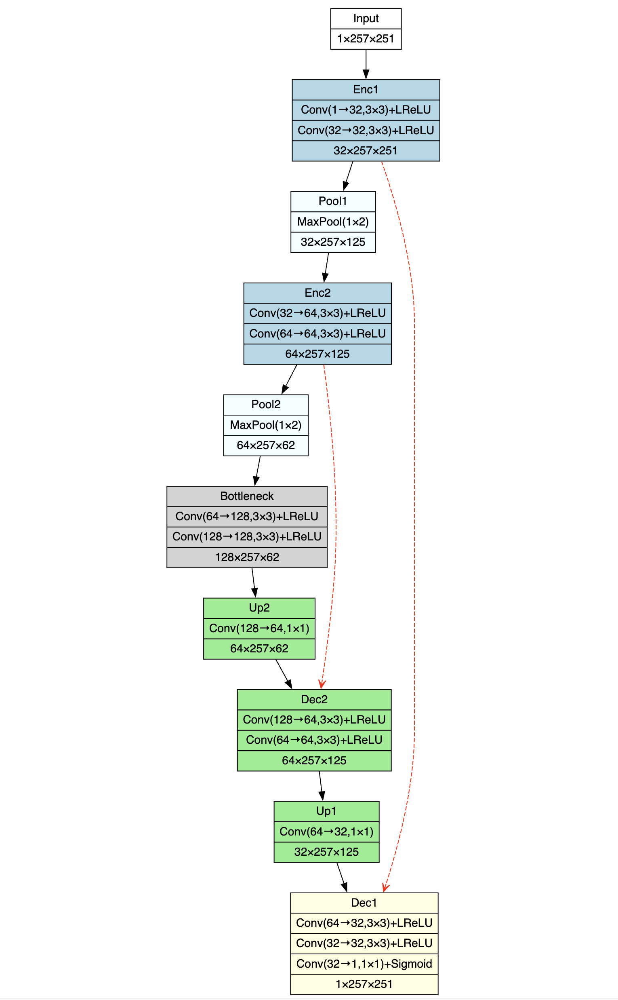
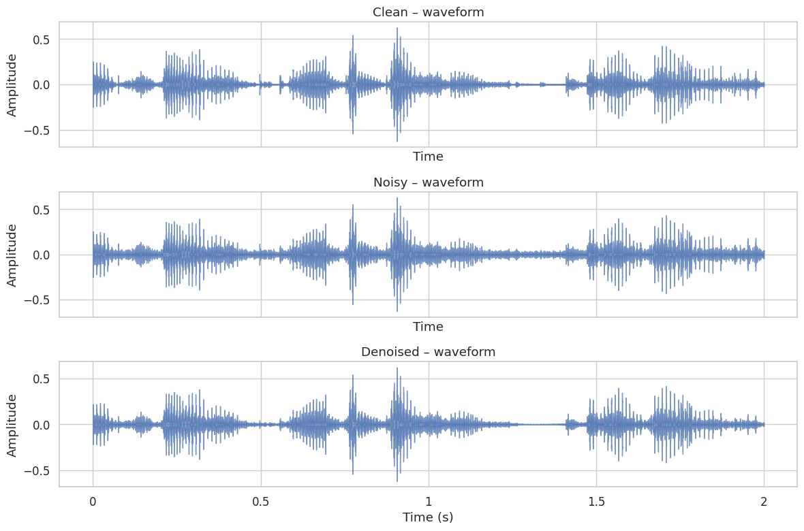
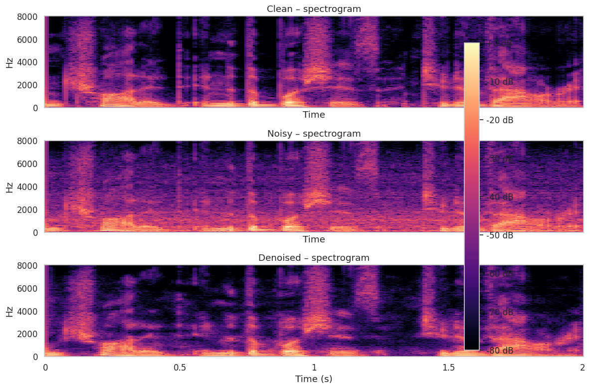
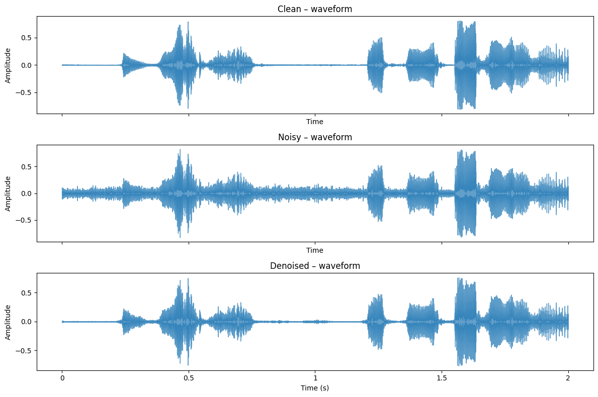

# Speech Signal Denoising: Reducing High-Frequency Noise with Autoencoders

## Overview 
This document evolved  as we progressed through the project. Part 1 outlines the conceptual design, including the problem statement, proposed solution, and dataset requirements. Part 2 describes the dataset used for training and evaluation. Part 3 details the first update, including the architecture, training process, and challenges encountered. Part 4 presents the second update, including improvements made to the model and results obtained. In Part 5, we evaluate our model on unseen test data and real-world recordings.

Here are the main sections of the document:
- [Part 1: Conceptual Design](#part-1-conceptual-design)
- [Part 2: Dataset](#part-2-dataset)
- [Part 3: First Update](#part-3-first-update)
- [Part 4: Second Update](#part-4-second-update)
- [Part 5: Final Update](#part-5-final-update)

As we progressed through the project, we added new sections to the document to reflect our evolving understanding and approach. But the previous sections kept their original content. That is why, we will see our implementation in part 3, and part 4 does not exactly match what we wrote in part 1. For example, we planned to use 100hour LibriSpeech dataset, we ended up using only the test-clean dataset to create our training and validation data, because we found that the test-clean dataset is already large enough to train our model. We just needed to add more diverse noise samples to the dataset.

Here is an overview of the directory structure:
- `src/`: Contains the source code for part 3 and part 4.
- `test/`: Contains the a script to denoise audio files using the trained model, and the trained models and parameters.
- `sample-data/`: Contains sample audio files used for testing and evaluation.
- `figures/`: Contains figures and plots used in the document.
- `README.md`: This document.


## Part 1: Conceptual Design

### Problem Statement
The goal of this project is to develop a speech signal denoiser capable of removing high-frequency noise from audio recordings. High-frequency noise—often introduced by environmental factors (e.g., electronic interference, wind) or recording equipment—degrades speech intelligibility and quality. Traditional denoising methods, such as filtering, often struggle with non-stationary or complex noise patterns and risk distorting the speech signal. To address this, we propose developing a deep learning-based speech denoiser using an autoencoder architecture. Autoencoders are well-suited for this task as they can learn to reconstruct clean signals from noisy inputs by capturing the underlying structure of the data.

### Proposed Solution
To address this challenge, the project will explore using a self-supervised autoencoder neural network trained on pairs of clean and synthetically corrupted speech signals. The denoiser will take a noisy speech signal as input and output a reconstructed, cleaner version. The model will be trained to reconstruct clean speech from synthetically noised input, using paired data without the need for manual labels.

At a high level, here are the key components of the proposed solution:
#### 1. **Autoencoder Architecture:**
We will follow the U-Net autoencoder architecture because it effectively captures both global and local patterns in structured data like spectrograms, making it well-suited for speech denoising tasks.

- **Encoder:** Compresses the noisy spectrogram into a low-dimensional latent representation using a series of convolutional and downsampling layers. This helps isolate core speech features while reducing noise.

- **Decoder:** Reconstructs a clean spectrogram from the latent representation using upsampling layers, guided by skip connections that restore fine-grained details lost during encoding.

We will experiment with different network depths, feature map sizes, and normalization techniques to balance model complexity and denoising performance.


#### 2. **Feature Representation:** 
The system will operate in the time-frequency domain.  Audio signals will be converted into spectrograms using a Short-Time Fourier Transform (STFT). This transforms the waveform into a structured 2D format (time vs frequency), making it easier to apply convolutional neural networks that can learn local and global noise patterns.

#### 3. **Learning Strategy:**
A hybrid loss function combining magnitude, waveform, and spectral reconstruction error guides the model to improve both objective and perceptual quality.

#### 4. **Noise Siimulation:**
Synthetic High-Frequency Noise: Clean speech from the LibriSpeech dataset will be corrupted with:

- **Gaussian Noise:** High-frequency band-limited noise.
- **Sine Waves:** Pure tones at frequencies >4 kHz.

### Dataset Requirements
#### Training Data:

- **Primary Source:** LibriSpeech train-clean-100 (100 hours of clean speech).

- **Noise Augmentation:** Synthetic high-frequency noise added to clean audio.

#### Validation Data:

- **Source:** LibriSpeech dev-clean (development set).

- **Purpose:** Tune hyperparameters (learning rate, network depth) and prevent overfitting.

#### Test Data:

- **Custom Recordings:** Real-world noisy speech samples recorded by the author.

- **Purpose:** Evaluate generalization to unseen noise types and recording conditions.

#### Key Technical Considerations
- **Phase Reconstruction:** Clean phase is not estimated; noisy phase is reused during inverse STFT. This is a simplification and may limit quality, but makes the system more stable and efficient.
- **Generalization:** While trained on synthetic noise, the final evaluation will include real-world noise to test robustness.


## Part 2: Dataset
This project uses the LibriSpeech ASR Corpus, a publicly available collection of clean, read English speech, as the primary source for training and validation data. To simulate noisy conditions, synthetic high-frequency noise will be added to clean speech samples, creating paired noisy-clean examples for training a self-supervised denoising model.

### Data Source

#### LibriSpeech (train-clean-100)

- ~100 hours of high-quality read English speech

- Used for generating training and validation data

- [Dataset Link](https://www.openslr.org/12)

#### LibriSpeech (dev-clean)

- Smaller development set for validation and tuning

- Ensures the model generalizes to unseen speaker data
- [Dataset Link](https://www.openslr.org/12)

#### Custom Noisy Speech Samples
- Real-world recordings of speech with high-frequency noise
- Used for final evaluation of the model's performance in practical scenarios

### Dataset Splits
- **Training Set (≈60%):** Subset of LibriSpeech train-clean-100, with synthetic noise added. Used to optimize model weights. And dev-clean for early prototyping.

- **Validation Set (≈20%):** Another subset from train-clean-100 and dev-clean. Used for hyperparameter tuning and early stopping.

- **Test Set (≈20%):** Another subset from train-clean-100 and dev-clean. And real-world recordings. Used for final evaluation of the model's performance.

### Audio Samples
- **Clean Speech:** Original recordings from LibriSpeech. ([8555-292519-0015.flac](sample-data/clean/8555-292519-0015.flac))
- **Noisy Speech:** Clean speech samples with synthetic high-frequency noise added.(
[8555-292519-0015.flac](sample-data/noisy/8555-292519-0015.flac))

## Part 3: First Update

### Overview

In this stage of the project, we have begun implementing and testing our proposed speech denoiser based on a U-Net autoencoder. Our initial goals were:

1. To establish a workable training pipeline that can load clean/noisy speech pairs, split them into a consistent format, and feed them into our neural network.

2. To overcome dimension mismatches caused by variable-length audio.

3. To run enough epochs to obtain an initial sense of interim results on the test-clean subset of LibriSpeech (augmented with synthetic high-frequency noise).

We have now placed all relevant code in our GitHub repository, ensuring it is easy to follow. This code includes:

- Preprocessing scripts to split variable-length audio files into fixed 2-second segments.

- Dataset classes to load paired .flac files, compute STFT log-magnitudes, and apply the same normalization used during training.

- A U-Net model definition (in PyTorch) that downsamples along the time axis and uses skip connections to preserve high-resolution details.

- Training routines that combine a magnitude-domain loss (L1 on spectrogram) with a time-domain loss (L1 on the waveform reconstructed via the noisy phase).


### Architecture Recap
Our approach employs a U-Net autoencoder that operates on log-magnitude STFT features. In more detail:

#### 1. STFT & Log Magnitude
- Each audio file is sampled at 16 kHz.

- We compute the Short-Time Fourier Transform (STFT) using n_fft=512, hop_length=128, and win_length=512.

- We take the magnitude of each complex STFT frame, then apply log(1+magnitude). This compresses the dynamic range and helps the network learn more effectively.

#### 2. Min-Max Normalization
- We gather global min and max log-magnitudes across a portion of the training set to define a scaling from [0,1].

- We scale each spectrogram to [0,1], feed it to the network, and then unscale at the output stage. This helps keep training stable and consistent.

#### 3. U-Net Structure

- **Downsampling:** We use two downsampling levels, but only along the time dimension (via MaxPool2d(kernel_size=(1,2))). This preserves the frequency dimension (which is often 257 bins for n_fft=512) and prevents dimension mismatches when we do skip connections.

- **Bottleneck:** After the second downsampling, we have a “bottleneck” block that learns high-level or global features of the spectrogram.

- **Upsampling:** We upsample to match the skip-connection shapes using F.interpolate(..., size=...), ensuring the exact original frequency/time shape is recovered.

- **Final:** A Conv2d(..., out_channels=1) plus a sigmoid activation returns the predicted log-magnitude (normalized to [0..1]), which we then unscale and exponentiate to revert to a linear magnitude.

#### 4. Hybrid Loss

- **Spectrogram (magnitude) loss:** L1 difference between predicted log-magnitude and target log-magnitude.

- **Waveform loss:** We take our predicted magnitude, combine it with the noisy phase, do iSTFT, and then measure L1 difference in time domain.

- By weighting these two objectives, we encourage accurate magnitude prediction and a plausible waveform reconstruction.

<!-- 
Thus, the network can handle 2D spectrograms (time vs. frequency) with a consistent shape for each batch, while leveraging skip connections to capture both local and global features relevant to removing high-frequency noise. -->

### Challenges Encountered
#### 1. Variable-Length Audio
One of our biggest early hurdles was dealing with the fact that LibriSpeech test-clean files come in varying durations. Similarly, real-world recordings or augmented noisy files can also differ widely. If we simply load entire waveforms, we get random shape mismatches (e.g., the STFT might have a time dimension of 125 frames in one file and 121 frames in another).

- **Initial Attempt:** We tried random slicing or dynamic upsampling, but it complicated the skip connections in the U-Net.

- **Chosen Solution:** We decided to split all audio into 2-second segments (exactly 32,000 samples at 16 kHz). This ensures each segment has a consistent shape. Then, the U-Net always deals with a fixed frequency/time shape, no matter which segment is loaded.
 <!-- (time dimension = 250 STFT frames). -->
 

- **Implementation:** In the included notebook for part 1, you can see our create_2sec_segments(...) function that loads each (clean, noisy) file pair, cuts them into 2-second chunks, and saves them as .flac. We skip any leftover <2s to keep it simple. 

#### 2. Normalization
Another challenge was ensuring we store and re-use the same min,max from training time at inference. Without these exact values, the model sees a different input scale at inference and produces degraded results.

- We overcame this by saving the global_min and global_max in a JSON file (same name as the model). So, if you check out model_2s_10_epoch.pth you’ll also see model_2s_10_epoch_params.json in the repo.

- This ensures reproducibility and consistent inference on any new noisy file.

#### Matching Clean & Noisy
We also needed to guarantee that for each 2s chunk, the “clean” .flac file and the “noisy” .flac file truly align. Sorting file lists by name might not be reliable if folder structures differ.

- We overcame this by building “maps” keyed by basename. That is, for each .flac in the clean folder, we store a dictionary entry {filename -> full_path}, and do the same for the noisy folder. Then we intersect the sets to get a common set of filenames.

- This ensures the chunk “123-456-0001_seg0.flac” in the clean folder pairs exactly with “123-456-0001_seg0.flac” in the noisy folder.

### Training Speed & Preliminary Results
We trained for ~10 epochs on the LibriSpeech test-clean data. The results are promising: you can audibly hear a significant reduction in high-frequency hiss when comparing the “Noisy” vs. “Denoised” audio. However, some distortion or muffling may still exist. We plan to refine the model further with more data and more epochs.

- **Noisy 2 Test Sample:** [noisy-test-sample-1.wav](sample-data/noisy/noisy-test-sample-1.wav)
- **Denoised 2s Test Sample:** [denoised-test-sample-1.wav](sample-data/denoised/denoised-test-sample-1.wav)

### Next Steps
#### 1. Train on Larger Data
Our next major milestone is to move beyond the ~1–2 hours of test-clean data to the train-clean-100 set (100 hours). That means we’ll generate many more 2-second segments, leading to a dataset large enough to capture robust patterns and handle real-world high-frequency noise.

We anticipate better generalization and more stable training with a larger dataset.

#### 2. Explore Additional Loss Functions

We currently combine an L1 spectrogram loss with an L1 time-domain loss. However, we might also consider more advanced STFT losses that weigh different frequency regions.
We can also measure objective speech quality metrics like PESQ or STOI to track improvements.


#### 3. Evaluate on Unseen Audio
We want to test on “unknown” audio , potentially from real-world recordings with environmental or equipment-based high-frequency noise. Because we store and share global_min, global_max, and STFT parameters, we can easily load any 16 kHz audio and run inference using the same approach. In the next update we will use train/validate/test split on train-clean-100 data. And in final update we will use real world recording. 

If the audio is longer than 2 seconds, we can split it (like we do in training) into multiple 2s segments, denoise each, then concatenate results.

#### Code
Here is the [notebook](src/part3-first-update-files/audio_denoising_poc_1.ipynb) for part3. It has all the code and results discussed above.

**Notes on LLM Usage:** I used chatgpt for brainstorming and refining my ideas. And I used copilot autocomplete for fixing grammar and sentence structure in this document.


## Part 4: Second Update

### 4.1 What’s new since Part 3 (First Udpate)

| Area | Part 3 status | Part 4 upgrade |
|------|---------------|----------------|
| **Noise domain** | 8455 segments of synthetic HF hiss only | Added *RealMix* set (road + exhaust‐fan recordings) mixed at 0–15 dB SNR; dataset now  ➔ 16910 pairs of 2‑second segments. |
| **Training regime** | 10 epochs, LR 1e‑4 | fine‑tune the model from first update for 80 epochs |
| **Validation strategy** | Hand‑picked clip | 70 / 15 / 15 stratified *train/val/test* split driven by manifest (see `segment_manifest.csv`). |
| **Inference window** | Fixed 2s | Added **overlap–add** (50 % Hann) to denoise arbitrarily long audio. |

### 4.2 Current network architecture

Here is a summary of the U-Net architecture used in this project:

- **Input:** normalised log‑magnitude STFT (1 × F × T).

- **Encoder path:**

    - Conv (1→32) × 2 → LeakyReLU → time‑only MaxPool (1×2).

    - Conv (32→64) × 2 → LeakyReLU → second MaxPool (1×2).

- **Bottleneck:** Conv (64→128) × 2 captures global context.

- **Decoder path (mirrored)**

    - 1 × 1 Conv (128→64) + nearest‑neighbour up‑sample → skip‑concat with encoder‑FMap → Conv block (64).

    - Repeat for shallow level (64→32).

- **Output head:** Conv (32→1) + Sigmoid ⇒ denoised log‑mag (0‑1).

Here is a diagram of the U-Net architecture:



The red arrows indicate the skip connections that concatenate feature maps from the encoder path to the decoder path. This allows the model to retain important details from the input signal while reconstructing the output.

The encoder path compresses the input signal into a lower-dimensional representation, while the decoder path reconstructs the output signal using skip connections to retain important details.

The model is trained to minimize a hybrid loss function that combines both magnitude and waveform losses, ensuring that the denoised output closely resembles the clean target signal. The use of LeakyReLU activations helps to mitigate the vanishing gradient problem, allowing for better training convergence.

## 4.3 Creating the RealMix dataset
The RealMix dataset is created by mixing clean speech with real-world noise recordings. The noise recordings are collected from various sources, including road noise and exhaust fan noise. The mixing process involves adjusting the signal-to-noise ratio (SNR) to create a range of noisy samples.

Here are some details of the mixing process:

- **Noise bank:** real road & exhaust‑fan recordings, resampled to 16 kHz and cached.

- **Pairing rule:** for every clean LibriSpeech file pick one random noise clip.

- **Match length**

    -  If noise shorter ⇒ tile noise until it covers the speech length.
    - If longer ⇒ crop.

- Random SNR in [0, 15 ] dB

- Compute RMS power of speech and noise.

- Derive scale factor k so that P_speech / (k²·P_noise) = 10^(SNR/10).

- Mix: y_mixed = y_clean + k·y_noise.

- I/O: save FLAC pairs under identical filenames in …/realmixed/{clean|noisy}.

- Idempotent: skip files that already exist to allow incremental runs.

 **Code:** The code is available in [src/part4-second-update-files/data_pre_processing.ipynb](src/part4-second-update-files/data_pre_processing.ipynb)

### 4.3 Fine‑tuning details

#### 4.3.1 Baseline training strategy (Part 3 recap)
- **Dataset:** 8455 synthetic 2‑s pairs.

- Log‑mag STFT front‑end (n_fft 512 / hop 128 / win 512).

- **Normalisation:** global min‑max estimated on 200 random segments.

- Loss = 0.5 × L1‑spectrogram + 0.5 × L1‑waveform (re‑using noisy phase).

- **Optimiser:** Adam, LR 1 e‑4, 10 epochs, batch 8.

- Inline audible sanity‑check every second epoch.

#### 4.3.2 Fine‑tuning strategy

- **Data manifest:** combines Synthetic + RealMix ➔ segment_manifest.csv. 
- **Stratified split:** 70 % train, 15 % val, 15 % test per source type. (train -> 11836, test -> 2538, val->2536)
- **Batch & loader:** batch 16, 4 workers, pinned memory, drop‑last for GPU efficiency.
- Warm‑start from best Part 3 weights; LR reduced to 2 e‑5.
- Mixed Precision (AMP) + GradScaler doubles throughput, halves VRAM.
- **Loss scheduling to reduce training time:**
    - Spectrogram loss every batch. 
    - Waveform loss every 5th batch (heavy) → overall weight 0.55.
- **Validation:** quick PESQ‑WB on 100 val segments every 2 epochs; early‑stopping with patience = 3.
- **Checkpoint:** Best PESQ model saved as models/best_finetune.pth.
- Qualitative demo clip played every 2 epochs.

**Epochs:** Fine tuned for 20 epochs for first step, then 50 epochs for second step with increased patience and lower learning rate.

### 4.4 Objective quality
| Split | PESQ‑WB ↑ | STOI ↑ | SI‑SNR [dB] ↑ |
|-------|-----------|--------|---------------|
| **Train** | `2.22` | `0.92` | `16.83` |
| **Val**   | `2.22` | `0.92` | `16.90` |
| **Test**  | `2.20` | `0.92` | `16.71` |


**Justification of the Evalulation Method:** Since this is not a classification task, we cannot use accuracy as a metric. Instead, we use three metrics that are commonly used in speech denoising tasks: PESQ-WB, STOI, and SI-SNR(zero-mean variant).
These metrics are widely accepted in the field of speech processing and have been shown to correlate well with human perception of speech quality and intelligibility.

- PESQ‑WB – perceptual speech quality; correlates with MOS, suitable for denoising.

- STOI – intelligibility score; gauges how well words remain recognisable.

- SI-SNR – scale-invariant signal-to-noise ratio. We zero-mean both reference and estimate (TasNet convention) before the projection step, so values are numerically identical to the “zero-mean SI-SDR” often reported in recent separation papers. In our notebok, we named it SI-SDR. We will refer it as SI-SNR in this document.

Together they capture quality, intelligibility and signal fidelity – a balanced trio for this task.

### 4.5 Qualitative snapshot
Here is a qualitative snapshot of the denoising performance on a sample audio clip. 

First lets listen to the three audio files: clean, noisy, and denoised. The clean audio is the original recording, while the noisy audio has high-frequency noise added. The denoised audio is the output of our trained model.

- [Clean Sample](sample-data/clean/clean-2s-sample-1.wav)
- [Noisy Sample](sample-data/noisy/noisy-2s-sample-1.wav)
- [Denoised Sample](sample-data/denoised/denoised-2s-sample-1.wav)


First, lets look at the waveform of the three audio files, clean at the top, noisy in the middle, and denoised at the bottom. We can see even though we miss some some details, the denoised audio removes most of the high-frequency noise present in the noisy audio.



And here is the spectrogram of the same audio files. The denoised audio has a much clearer spectrogram, with less noise present in the high-frequency range.


### 4.6 Denoising Longer Audio
The model is trained on 2‑s segments, but we want to denoise longer audio files. To achieve this, we use an overlap–add strategy with a 50% overlap and a Hann window.
This involves the following steps:
1. **Segment the audio:** Split the input audio into overlapping 2‑s segments with a 50% overlap.
2. **Denoise each segment:** Pass each segment through the trained model to obtain the denoised output.
3. **Overlap–add:** Combine the denoised segments using a Hann window to smooth the transitions between segments.
4. **Output the final denoised audio:** Save the combined output as a single audio file.

The overlap–add process ensures that the model can handle longer audio files while maintaining the quality of the denoised output. The 50% overlap helps to reduce artifacts at the segment boundaries, and the Hann window smooths the transitions between segments.

**Code:** The code for the overlap–add process is included in the `denoise_audio.py` script.


### 4.7 Running the Trained Model on Noisy Samples

The `test` folder contains a script `denoise_audio.py` that can be used to denoise audio files using the trained model. The `test/models` folder contains the trained models and parameters. The required dependencies are listed in the `environment.yaml` file.

To get started with the denoising script, change to the `test` directory. Then create a conda environment using the provided `environment.yaml` file:

```bash
conda env create -f environment.yaml
```

Then activate the environment:
```bash
conda activate audio_denoising_eval
```

To run the denoising script, use the following command:

```bash
python denoise_audio.py -i <path_to_noisy_audio> -o <output_path> -m <model_path> -p <params_path>
```

For example, to denoise a sample audio file in the `noisy_sample` directory, run the following command:

```bash
python denoise_audio.py \
-i noisy_sample/noisy-sample-1-syn-noise.wav \
-o denoise_output.wav \
-m models/best_finetuned_model.pth \
-p models/best_finetuned_model_params.json             
```
To get all the available options, run the following command:

```bash
python denoise_audio.py -h
```

Here is the output of the command:

```
usage: denoise_audio.py [-h] -i NOISY_AUDIO [-o OUTPUT] [-m MODEL] [-p PARAMS] [--overlap OVERLAP]

Denoise long audio files with DesnoingUNet Autoencoder

options:
  -h, --help            show this help message and exit
  -i NOISY_AUDIO, --noisy-audio NOISY_AUDIO
                        Path to noisy input audio (.flac/.wav)
  -o OUTPUT, --output OUTPUT
                        Output path
  -m MODEL, --model MODEL
                        Model file path
  -p PARAMS, --params PARAMS
                        Params file path
  --overlap OVERLAP     Overlap ratio between segments
  ````
  
### 4.8 Commentary/Observations & Next Steps

Here are some observations and next steps based on the results obtained so far:

- **Model Generalization:** The model is able to generalize well to unseen data, as indicated by the test evaluation metrics on the test set. All three metrics (PESQ, STOI, and SI-SNR) have very similar values across the train, validation, and test sets. The training PESQ is slightly higher than the test PESQ, but not significantly. This indicates that the model is not overfitting too much and is able to generalize well to unseen data.

- **Perceptual Quality:** PESQ is 2.20 (WB) on the test set, which is a good score for speech denoising. However, we can still improve it further by fine-tuning the model and exploring different architectures.

- **Intelligibility:** The model is able to preserve the intelligibility of the speech signal, as indicated by the STOI score of 0.92 on the test set. This means that the model is able to remove most of the high-frequency noise while preserving the intelligibility of the speech signal.

- **Signal Fidelity:** The SI-SNR score of 16.71 dB on the test set indicates that the model is able to remove most of the high-frequency noise while preserving the signal fidelity. This is a good score for speech denoising.

- **Qualitative Results:** The denoised audio sounds much clearer and less noisy than the original noisy audio. But there is still some distortion or muffling present in the denoised audio. This is expected, as the model is still in the early stages of training and can be improved further.

**Threats to Validity:**
- The model is trained on synthetic noise and a small set of real-world noise recordings. While the model performs well on the test set, it may not generalize well to other types of noise or real-world recordings. We need to test the model on a larger and more diverse set of real-world recordings to ensure that it can handle different types of noise.

- The model is trained on a small set of clean speech recordings. While the model performs well on the test set, it may not generalize well to other speakers or accents. We need to test the model on a larger and more diverse set of clean speech recordings to ensure that it can handle different speakers and accents.

**Improvement in Next Steps:**
- We already created a pipleline to mix real-world noise with clean speech. We can use this to create a larger dataset of mixed audio files. We just need to record some more noise samples.
- We will finetune the model on noise recorded with my phone and test with noisy speech samples recorded with my phone. This will help us to evaluate the model on real-world recordings and see how well it generalizes to different types of noise.

### Source Code and Artifacts
The source code for part 4 is available in the `src/part4-second-update-files` directory. The main files of interest are:
- `data_pre_processing.ipynb`: This notebook contains the code for creating the RealMix dataset by mixing clean speech with real-world noise recordings.
- `speech_denoising_autoencoder_update_2.ipynb`: This notebook contains the code for fine-tuning and evaluating the U-Net autoencoder model on the RealMix dataset.
- `segment_manifest.csv`: This file contains the manifest of the mixed dataset, including the paths to the clean and noisy audio files.

The `test` directory contains the `denoise_audio.py` script that can be used to denoise audio files using the trained model. The `models` folder contains the trained models and parameters. The required dependencies are listed in the `environment.yaml` file.


## Part 5: Final Update

### 5.1 What’s new since Part 4 (Second Udpate)
- Further fine-tuning of the model on the RealMix dataset with additional noise samples.
- Evaluation of the final model on unseen test data and real-world recordings.

### 5.2 Architecture Recap
The architecture of the U-Net autoencoder remains the same as described in Part 4. The model is trained to minimize a hybrid loss function that combines both magnitude and waveform losses, ensuring that the denoised output closely resembles the clean target signal. The model uses a U-Net architecture with skip connections to capture both local and global features relevant to removing high-frequency noise. The encoder path compresses the input signal into a lower-dimensional representation, while the decoder path reconstructs the output signal using skip connections to retain important details.

The model is trained on 2-s segments of audio, and the overlap–add strategy is used to denoise longer audio files. The model is able to generalize well to unseen data, as indicated by the test evaluation metrics on the test set. The training PESQ is slightly higher than the test PESQ, but not significantly. This indicates that the model is not overfitting too much and is able to generalize well to unseen data.

See [4.2](#42-current-network-architecture) for more details on the architecture.

### 5.3 Training Dataset Recap
We initially planned to use the LibriSpeech `train-clean-100` dataset, but we found that the `test-clean` dataset is already large enough to train our model. We just needed to add more diverse noise samples to the dataset. 

LibriSpeech `test-clean` dataset contains 2620 audio samples. We used 4 real-world noise recording from my phone to create 2620 noisy audio samples. We mixed the clean audio samples with the noise recordings at different SNR levels (0, 5, 10, 15 dB). This resulted in a total of 2620 clean audio samples and 2620 noisy audio samples.

We then created two seconds segments of the audio samples. This resulted in a total of 16910 clean audio segments and 16910 noisy audio segments. We created a manifest file `segment_manifest.csv` that contains the paths to the clean and noisy audio files. We created a stratified split of the dataset into 70% training, 15% validation, and 15% test sets. The training set contains 11836 segments, the validation set contains 2536 segments, and the test set contains 2538 segments.

This training set was used to fin-tune our baseline model. The baseline model was trained on 8455 segments of synthetic high-frequency noise only. The training set was then augmented with real-world noise recordings to create the RealMix dataset.

The code for creating the training dataset is available in the `src/part4-second-update-files/data_pre_processing.ipynb` notebook. The manifest file `segment_manifest.csv` is also included in the `src/part4-second-update-files` directory.

### 5.4 Description of Test Dataset (Unseen Data)
Even though in our fine-tuning step we used a stratified split of the dataset into training, validation, and test sets, our baseline model was trained a dataset created from the entire `test-clean` dataset. In fine-tuning step, we used different noise samples, but the clean audio samples were the same. So, model have already seen the clean audio samples in the training step. For this reason, to evaluate generalization to unseen data, we will use a different test dataset.

We used LibriSpeech `dev-clean` dataset to create our final test dataset. The `dev-clean` dataset contains 2703 audio samples. We samples 273 audio samples from the `dev-clean` dataset. We used 4 real-world noise recording from my phone to create 237 noisy audio samples. We mixed the clean audio samples with the noise recordings at different SNR levels (0, 5, 10, 15 dB). Then we created two seconds segments of the audio samples. This resulted in a total of 913 clean audio segments and 913 noisy audio segments. We used this dataset to evaluate the final model.


### 5.5 Evaluation of the Final Model on Unseen Test Data
In our fine-tuning step, we used PESQ-WB, STOI, and SI-SNR as our evaluation metrics.  Since this is not a classification task, we cannot use accuracy as a metric. PESQ-WB stands for Perceptual Evaluation of Speech Quality (Wideband), which is a widely used metric for evaluating the quality of speech signals. STOI stands for Short-Time Objective Intelligibility, which measures the intelligibility of speech signals. SI-SNR stands for Scale-Invariant Signal-to-Noise Ratio, which measures the distortion in the output signal. We zero-mean both reference and estimate (TasNet convention) before the projection step, so values are numerically identical to the “zero-mean SI-SDR” often reported in recent separation papers. In our part 4 notebok, we named it SI-SDR. We will refer it as SI-SNR in this document. 

For our final test dataset, we got the following results:
- **PESQ-WB:** 1.91
- **STOI:** 0.87
- **SI-SNR:** 13.59 dB

In comparison, we got the following results on the training and validation and previous test datasets:
| Split | PESQ‑WB ↑ | STOI ↑ | SI‑SNR [dB] ↑ |
|-------|-----------|--------|---------------|
| **Train** | `2.22` | `0.92` | `16.83` |
| **Val**   | `2.22` | `0.92` | `16.90` |
| **Test**  | `2.20` | `0.92` | `16.71` |

In the next section, we will discuss the reasons for this and how we can improve the model further.

### 5.6 Observation from Unseen Data Evaluation
Lets first understand the results we got on the unseen test data. The PESQ-WB score of 1.91 indicates that the model is able to remove some of the high-frequency noise present in the noisy audio, but there is still some distortion or muffling present in the denoised audio. But the STOI score of 0.87 signifies a relatively high degree of speech intelligibility.  An STOI score of 0.87 suggests that the denoised speech remains largely understandable, with listeners likely able to discern the spoken words and their meaning. 

In essence, while the STOI score indicates that the model effectively preserves the content of the speech, the PESQ-WB score reveals that the overall listening experience is compromised. The model manages to remove enough noise for the words to be understood, but it introduces or fails to eliminate other distortions that detract from the perceived naturalness and clarity of the speech.

The SI-SNR of 13.59 dB confirms that the model is indeed reducing the overall level of noise and distortion. However, the perceptual quality, as captured by PESQ-WB, is not on par with this reduction. This suggests that the model's distortion reduction is not always aligned with what humans perceive as high-quality audio.

The qualitative results also support this. The denoised audio sounds much clearer and less noisy than the original noisy audio. But there is still some distortion or muffling present in the denoised audio. This is expected, as the model is still in the early stages of training and can be improved further. Here are three audio files: clean, noisy, and denoised. The clean audio is the original recording, while the noisy audio has high-frequency noise added. The denoised audio is the output of our trained model.

- [Clean Sample](sample-data/clean/part5-clean-sample-1.wav)
- [Noisy Sample](sample-data/noisy/part5-noisy-sample-1.wav)
- [Denoised Sample](sample-data/denoised/part5-denoised-sample-1.wav)

Here is the waveform of these three audio files, clean at the top, noisy in the middle, and denoised at the bottom. We can see that mdoel is able to remove most of the high-frequency noise present in the noisy audio. 



Now that we understand the results we got on the unseen test data, lets compare it with the results we got on the training and validation datasets. In all three matrics, the scores are  higher than the scores we got on the unseen test data. This indicates that the model is probably overfitting to the training data. The model is able to learn the patterns in the training data, but it is not able to generalize well to unseen data. 

Here are some possible reasons for this:
- **Limited diversity in Speaker Voice:** Our training dataset is created from the LibriSpeech `test-clean` dataset, which contains a limited number of speakers. The model may not be able to generalize well to unseen speakers or accents. We need to test the model on a larger and more diverse set of clean speech recordings to ensure that it can handle different speakers and accents.
- **Limited diversity in Noise Samples:** The model is trained on a limited set of noise samples. We need to test the model on a larger and more diverse set of noise recordings to ensure that it can handle different types of noise.
- **Limited training data:** Although we thought that the `test-clean` dataset is large enough to train our model, it is still a small dataset compared to the `train-clean-100` dataset. We need to train the model on a larger dataset to ensure that it can generalize well to unseen data.

### 5.7 Real-World Noisy Sample Evaluation
We also evaluated the model on real-world noisy samples. We recorded some speech audio samples with my phone in a noisy environment. We then denoised the audio samples using the trained model. Since we do not have the clean audio samples, we cannot evaluate the model using PESQ-WB, STOI, and SI-SNR metrics. But we can look at the waveform and spectrogram of the denoised audio samples to see how well the model is able to remove the high-frequency noise.

**todo: add audio samples and figures**


### 5.8 Running the Trained Model on Noisy Samples
The `test` folder contains a script `denoise_audio.py` that can be used to denoise audio files using the trained model. The `test/models` folder contains the trained models and parameters. The required dependencies are listed in the `environment.yaml` file.
To get started with the denoising script, change to the `test` directory. Then create a conda environment using the provided `environment.yaml` file:

```bash
conda env create -f environment.yaml
```

Then activate the environment:
```bash
conda activate audio_denoising_eval
``` 
Then run the denoising script using the following command:

```bash
python denoise_audio.py \
-i noisy_sample/noisy-sample-1-syn-noise.wav \
-o denoise_output.wav \
-m models/best_finetuned_model.pth \
-p models/best_finetuned_model_params.json             
```
Section 4.7 has more details on how to run the denoising script.

### Source Code and Artifacts
The source code for part 5 is available in the `src/part5-final-update` directory. 
todo: add file names

